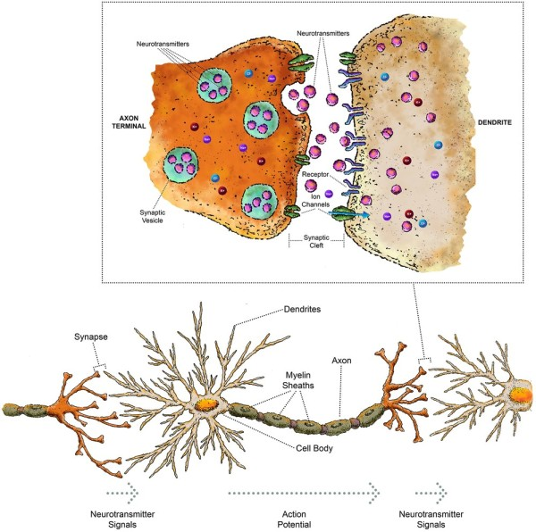
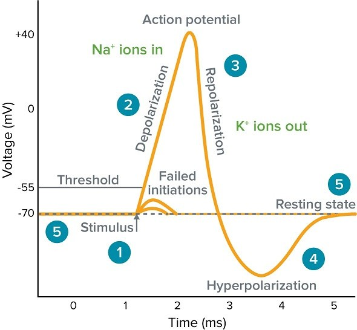

# SpikeStack
An exploratory software stack for Neuromorphic computing

Because SNNs and Neuromorphic computing is at a relatively early stage of commercial adoption, there is a big gap in toolchain support: compilers, mappers, debuggers, etc. SpikeStack tries to fill this gap by being an IR and compilation pipeline that sits between the SpikeStack SNN simulator and neuromorphic hardware targets. This means that SpikeStack should include a C++ SNN simulator, a hardware-targeting compiler backend, and a neuromorphic IR. The aim is to explore the "Mapping Problem" - translating a logical SNN graph onto a physical neuromorphic chip core.

## How biological neurons work
### 0 - Main parts of a neuron
**Dendrites**: These branch out and connect one neuron to other neurons, to receive chemical signals.

**Cell body**: Processes incoming spikes.

**Axom**: The long fibre that carries spikes away from the cell body.

**Synapse**: The microscopic gap between neurons where signals are exchanged.

### 1 - Generating the Action potential 
When a neuron's membrane voltage crosses v_threshold, voltage-gated sodium channels in the cell membrane open - allowing an influx of sodium ions. This drives the membrane potential rapidly up from roughly -55mV to +40mV in less than a millisecond. Then sodium channel close and potassium channels open, driving voltage back down. Initially the voltage is driven below v_rest (to v_reset), but slowly returns to v_rest.

### 2 - Arriving at the Synapse
When action potential reaches the presynaptic terminal:
* Voltage-gated calcium channels open, calcium channels rush into the terminal.
* The calcium triggers Neurotransmitters to be sent across the synaptic cleft.
* The neurotransmitters bind to receptors at the postsynaptic neuron, opening ion channels.
* The ion flow produces a postsynaptic potential (PSP) - a small voltage change in the postsynaptic neuron.
* Magnitude of the PSP is determined by synaptic weight: the amount of neurotransmitters sent, number of receptors, and how sensitive they are. And this is what we model as a weight matrix in computation.

### 3 - Spike Integration
A single PSP is typically not enough to fire a neuron - firing requires a summation of many spikes. Summation can happen in two ways. **Spatial summation** occurs when multiple synapses on the neuron receive a spike simultaneously - their PSPs add together. **Temporal summation** occurs when a single synapse fires repeatedly in quick succession - the PSPs overlap in time and accumulate.

PSP decays over time, with the voltage tending towards resting - the rate of this decay is characterized by the membrane time constant tau (τ). Two spikes must arrive within one time constant in order to temporally accumulate. The "leaky" in Leaky-Integrate-and-Fire Neurons refer to this - neurons leak PSP in between spikes, and only fires if enough inputs arrive closely in time.

## SpikeStack Architecture Diagram

# Notes
* Time units are in milliseconds.
* Voltage units are in millivolts.

# References
* https://neuromorphiccore.ai/